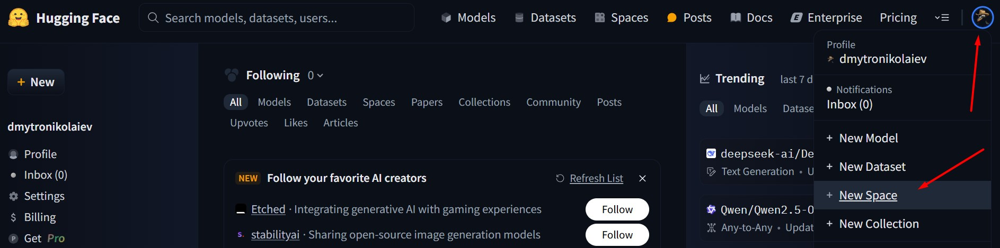
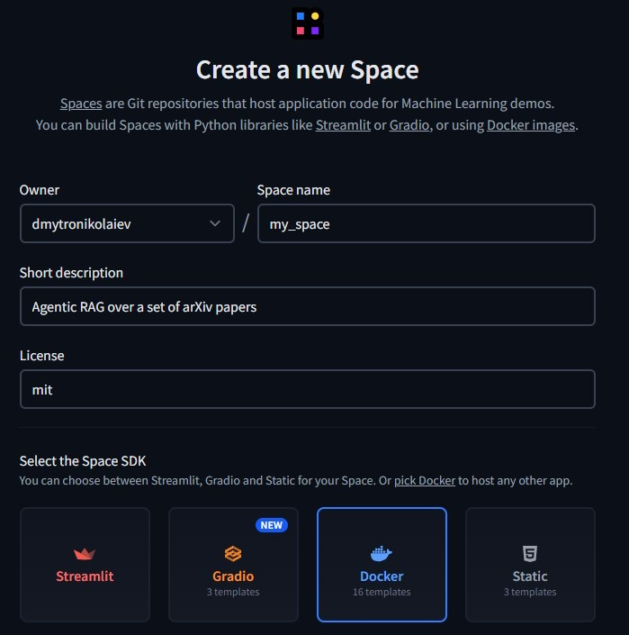
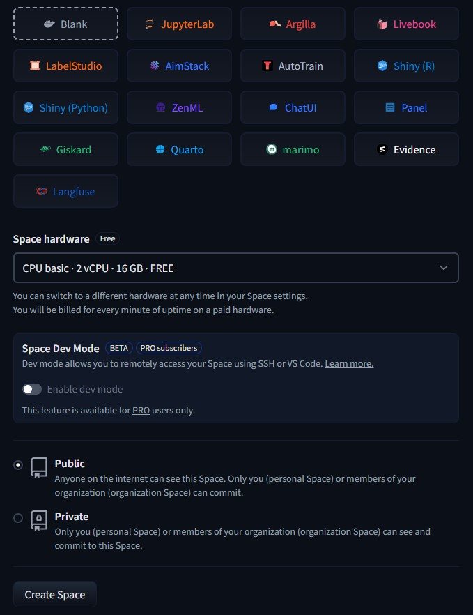
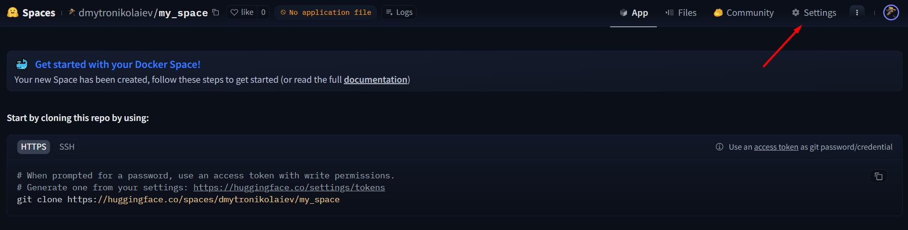
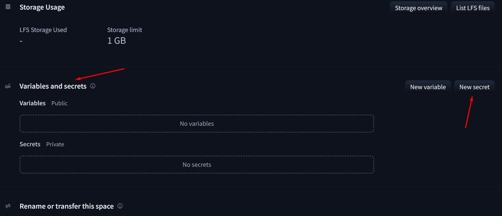
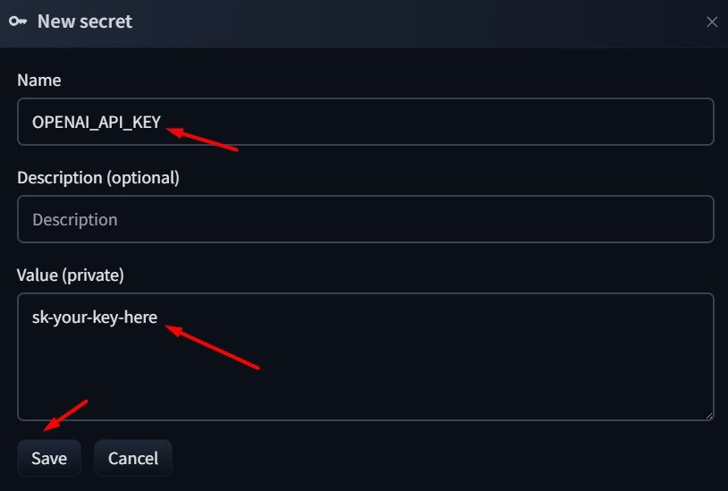
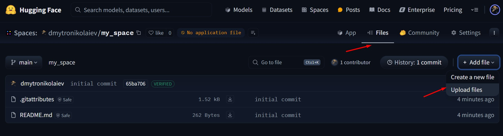
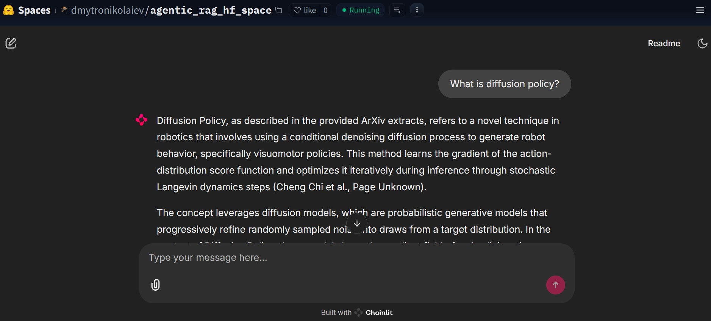

# Build Multi-Agent Applications Demo - Chainlit + Hugging Face Spaces Deployment + Evaluation

## Set up

- Python 3.11
- `pip install -r requirements.txt`
- Copy `.env.example` as `.env` and fill in your [Tavily](https://app.tavily.com), [OpenAI](https://platform.openai.com/api-keys) and [LangSmith](https://smith.langchain.com/settings) API keys

## Running Application & Evaluations

Run `chainlit run app.py` to run an application locally.

Run `python evals/run_evals.py` to perform an evaluation run

**Note**: you could want to run evals on subset of questions first to confirm it's working as expected. For that, you need to modify `evals/data/questions.yaml`

## Hugging Face Deployment - Step-by-Step Instruction

_NOTE: Hugging Face Spaces may update its UI over time. While these steps are accurate as of writing, things may look slightly different in the future._

Before deploying, make sure you have a Hugging Face account and your application is running as expected locally.

### 1. Create a New Space

Click your profile icon in the top right corner and select "New Space" from the dropdown menu.



Fill in the form. Select **Docker/Blank** for Space SDK, **free** space hardware and **public** visibility if you want to share your space. For other values you can use following parameters:

```
---
title: Build Multi-Agent Applications Chainlit Demo
emoji: 🤖
colorFrom: yellow
colorTo: gray
sdk: docker
pinned: false
license: mit
short_description: Agentic RAG over ArXiv 2305.10343.pdf and 2303.04137.pdf
---
```





### 2. Set up API Keys

Once your Space is created, go to **Settings** in the top right corner, then scroll to **Variables and secrets** and add your API keys as secrets.







**Remember that you will be charged based on these API keys usage so be mindful when sharing the application with the public.** Alternatively, you could ask for an API key on the UI side.

### 3. Upload Your Code

Add your code to the Space. The easiest way is to clone your space repo into a separate folder, copy the content of this repo there and push it. You could also upload files though UI or follow [this guide](https://github.com/ruslanmv/How-to-Sync-Hugging-Face-Spaces-with-a-GitHub-Repository).



### 4. Wait for the Build

Once files are uploaded or pushed, the Space will automatically build your app. This can take a minute or two depending on the dependencies.

### 5. See It Live!



## Next steps ideas

UI:
- [ ] Ask for API keys in the UI instead of storing them as secrets
- [ ] Allow to upload pdfs though the UI

Evaluation:
- [ ] Expand evaluation set
- [ ] Produce evaluation reports, for example with sliced metrics per category

Refactoring:
- [ ] Set up CI/CD by adding `.github/workflows`
